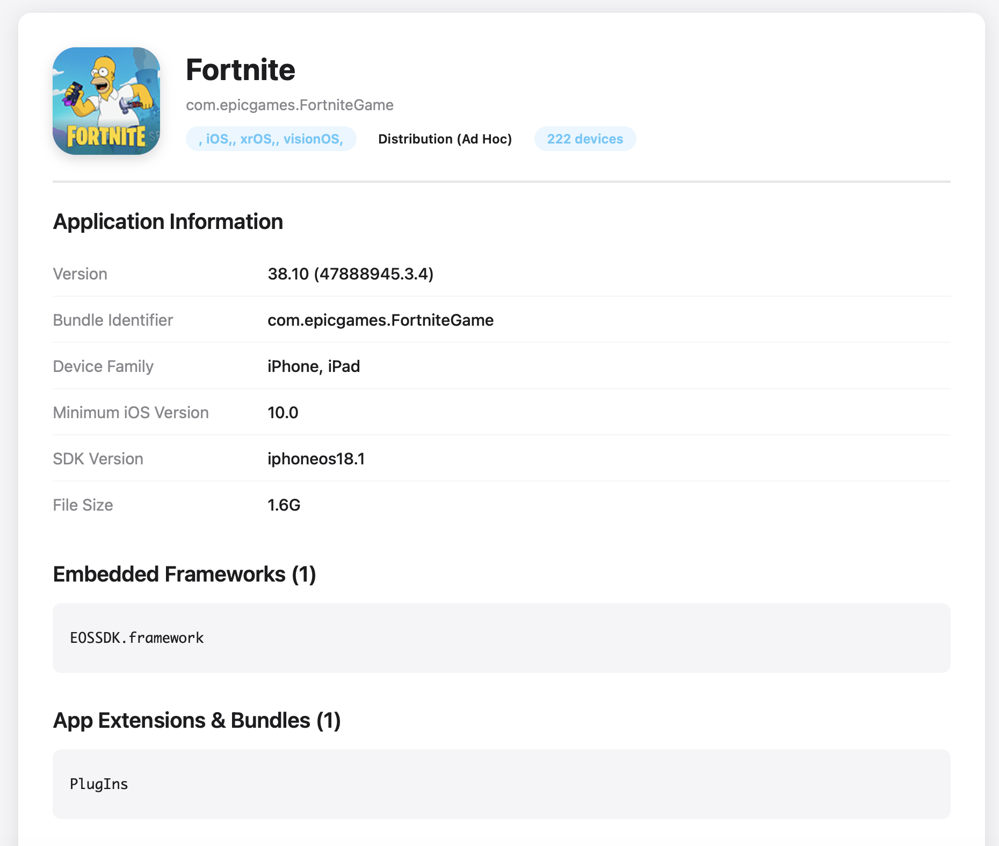
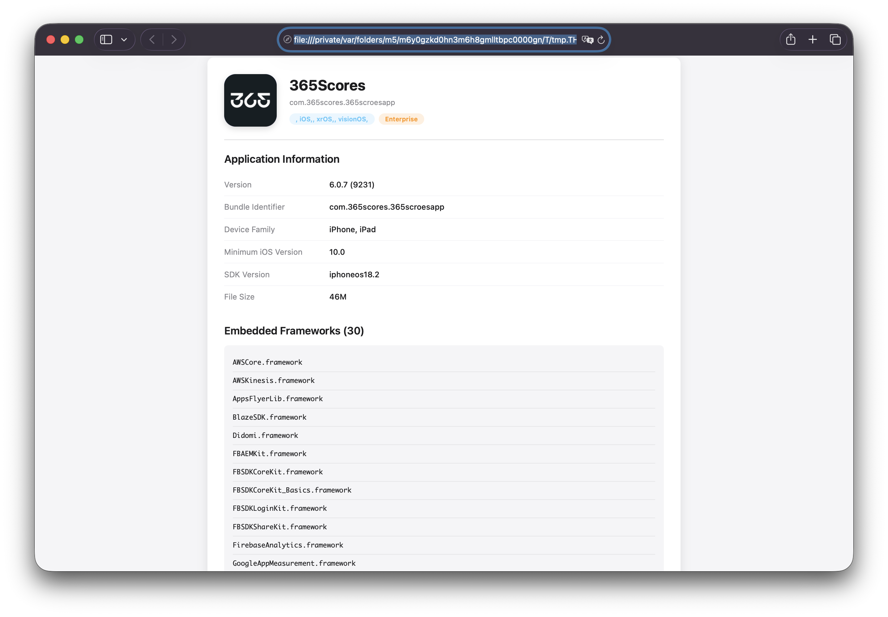

# عارض تفاصيل IPA

<div align="center">


**[العربية](README.md)** | **[English](README_EN.md)**

تطبيق سريع وخفيف لنظام macOS لعرض تفاصيل حزم تطبيقات iOS (ملفات `.ipa`) وملفات التوقيع على أجهزة Mac المزودة بمعالج Apple Silicon.

</div>

---

## 📸 لقطات الشاشة

<div align="center">

### معاينة ملف IPA

*تفاصيل شاملة للتطبيق تشمل الأطر، الصلاحيات، والشهادات*

### معاينة ملف التوقيع

*تفاصيل كاملة لملف التوقيع مع معرفات الأجهزة والشهادات*

</div>

---

## 🔬 للمطورين الذين يعشقون التفاصيل

**عارض تفاصيل IPA** - أداة تقنية متقدمة للمطورين المحترفين 🚀

### 📂 الصيغ المدعومة
- 📱 **`.ipa`** → تطبيقات iOS كاملة
- 🔐 **`.mobileprovision`** → ملفات التوقيع
- 📋 **`.provisionprofile`** → بروفايلات التوقيع
- 📦 **`.app`** → حزم التطبيقات مباشرة

### 🎯 ما تحصل عليه
- ✨ معلومات التطبيق الكاملة (Bundle ID, Version, SDK)
- 🔒 شهادات الأمان + SHA-1 Fingerprints
- 📋 Entitlements منسقة بشكل احترافي
- 📚 قائمة Frameworks & Bundles المضمنة
- 🆔 Device UDIDs للملفات المصرح بها
- 👥 تفاصيل Team & Provisioning

### ⚡ الأداء المتقدم
- ✅ استخراج ذكي (Info.plist + embedded.mobileprovision فقط)
- ✅ معاينة في **ثانيتين** بدل 15 ثانية
- ✅ بدون QuickLook dependencies
- ✅ بدون SIP disabled
- ✅ يعمل native على Apple Silicon

### 🛠 التقنيات المستخدمة
- **Bash + AppleScript** للتكامل مع macOS
- **macOS Native Tools** (security, openssl, PlistBuddy)
- **HTML5 + CSS3** للواجهة الحديثة
- **CMS Decoding** للشهادات والتوقيعات

---

## المميزات

- 📱 **تحليل ملفات IPA** - عرض تفاصيل شاملة حول تطبيقات iOS
- 🔐 **عارض ملفات التوقيع** - فحص ملفات `.mobileprovision` و `.provisionprofile`
- 📦 **دعم حزم التطبيقات** - فحص ملفات `.app` مباشرة
- ⚡ **أداء سريع** - استخراج محسّن، يقرأ الملفات الضرورية فقط
- 🎨 **واجهة نظيفة** - معاينة HTML حديثة في المتصفح الافتراضي

## ما يعرضه التطبيق

### لملفات IPA:
- **معلومات التطبيق**: الاسم، الإصدار، معرف الحزمة، عائلة الأجهزة، الحد الأدنى لإصدار iOS، إصدار SDK، حجم الملف
- **أطر العمل المضمنة**: جميع مكتبات أطر العمل المستخدمة في التطبيق
- **ملحقات التطبيق والحزم**: المكونات الإضافية، الودجات، ملحقات التطبيق
- **ملف التوقيع**: الاسم، UUID، الفريق، معرف التطبيق، تواريخ الإنشاء/الانتهاء، نوع الملف
- **الصلاحيات**: جميع صلاحيات التطبيق بتنسيق مناسب
- **الشهادات**: تفاصيل الشهادة الكاملة بما في ذلك الاسم، التواريخ، الرقم التسلسلي، بصمة SHA-1
- **الأجهزة المصرح بها**: قائمة كاملة بمعرفات UDID للأجهزة (لملفات التطوير/Ad Hoc)

### لملفات التوقيع:
- معلومات الملف (الاسم، UUID، الفريق، معرف التطبيق، المنصة)
- الصلاحيات
- الأجهزة المصرح بها
- تفاصيل الشهادة

## التثبيت

راجع [دليل التثبيت بالعربية](docs/INSTALL_AR.md) للحصول على تعليمات مفصلة.

## الاستخدام

### الطريقة 1: قائمة النقر بالزر الأيمن
1. انقر بزر الماوس الأيمن على أي ملف `.ipa` أو `.mobileprovision` أو `.app`
2. اختر **فتح بواسطة** → **IPA Details**
3. ستفتح المعاينة في متصفحك

### الطريقة 2: تعيين كعارض افتراضي
1. انقر بزر الماوس الأيمن على ملف IPA
2. اختر **الحصول على معلومات** (⌘+I)
3. تحت "فتح بواسطة:"، اختر **IPA Details**
4. انقر على **تغيير الكل...** لتعيينه كعارض افتراضي لجميع ملفات IPA

### الطريقة 3: النقر المزدوج
بمجرد تعيينه كعارض افتراضي، ببساطة انقر نقرًا مزدوجًا على أي ملف IPA لعرض تفاصيله

## كيف يعمل

على عكس إضافات QuickLook التقليدية (التي لم تعد تعمل على macOS الحديث بسبب قيود الأمان)، يقوم عارض تفاصيل IPA بـ:

1. استخدام غلاف تطبيق قائم على AppleScript للتعامل مع فتح الملفات
2. استخراج الملفات الضرورية فقط من أرشيفات IPA (وليس الحزمة بأكملها)
3. تحليل ملفات التوقيع والشهادات باستخدام أدوات macOS الأصلية
4. إنشاء معاينة HTML منسقة
5. فتح المعاينة في المتصفح الافتراضي

يعمل هذا النهج بشكل موثوق على أجهزة Mac المزودة بمعالج Apple Silicon دون الحاجة إلى تعطيل System Integrity Protection (SIP).

## التفاصيل التقنية

- **بدون إضافة QuickLook**: إضافات `.qlgenerator` التقليدية لا تعمل على macOS الحديث
- **استخراج سريع**: يستخرج فقط `Info.plist` و `embedded.mobileprovision` وملف أيقونة واحد
- **أدوات أصلية**: يستخدم `security` و `defaults` و `openssl` و `PlistBuddy` للتحليل
- **تحليل الشهادات**: يستخرج معلومات الشهادة الكاملة بما في ذلك بصمات SHA-1
- **عرض الصلاحيات**: يقوم بتنسيق جميع صلاحيات التطبيق بشكل صحيح
- **المعالجة في الخلفية**: يحتفظ بالملفات المؤقتة حتى إغلاق المتصفح

## إلغاء التثبيت

```bash
sudo rm -rf "/Applications/IPA Details.app"
/System/Library/Frameworks/CoreServices.framework/Frameworks/LaunchServices.framework/Support/lsregister -u "/Applications/IPA Details.app"
```

## الإلهام

تم إنشاء هذا المشروع بإلهام من [ProvisionQL](https://github.com/ealeksandrov/ProvisionQL)، الذي قدم معاينة QuickLook لملفات التوقيع وملفات IPA. نظرًا لأن إضافات QuickLook لم تعد تعمل على أجهزة Mac المزودة بمعالج Apple Silicon، يوفر هذا المشروع حلاً بديلاً.

## الترخيص

ترخيص MIT - راجع ملف LICENSE للحصول على التفاصيل

## المساهمة

المساهمات مرحب بها! لا تتردد في إرسال Pull Request.

## المطور

صنع بواسطة **x7mii** 🚀

## شكر وتقدير

- مبني على وظائف [ProvisionQL](https://github.com/ealeksandrov/ProvisionQL)
- يستخدم أدوات سطر الأوامر الأصلية لنظام macOS للتحليل
